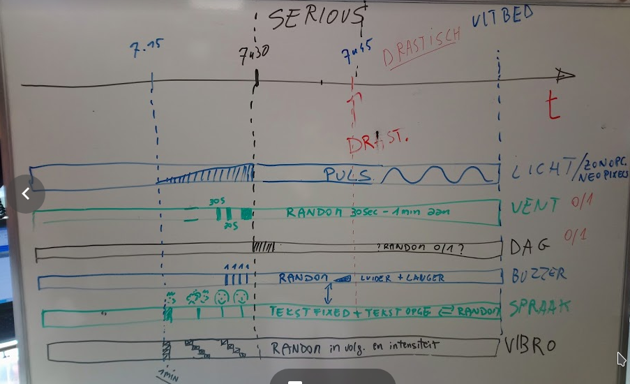

# Intel.Letto
An intelligent alarm clock connected to your bed. This is an alarm developed for a Belgian tv show, [Team Scheire](http://www.canvas.be/team-scheire), in order to help somebody who does not wake up from normal alarms, due to a disturbed sleeping cycle. 
Before using this solution, contact a doctor to determine your sleeping disorder! Intel.Letto was used to help with Delayed Sleep Phase Syndrome (DSPS), but could be useful in other cases. Nevertheless, a technical solution is **never** the complete answer, a doctor should be your first stop!

Intel.Letto works by working on all stimuli:

* sound: a normal buzzer
* sound: voices, animals, reminders. Interaction that requires the brain to listen
* touch: wind from a fan blowing irregularly
* touch: massage movement in an irregular unpredictable way
* light: waking up requires high lumen light to be switched on
* light: in the pre-alarm phase we add sunrise to help becoming aware of the need to get up.
* brain activity: deep sleepers can switch of alarms, then continue sleeping. To avoid this, a bed detector is present. You can only switch of the alarm when you are *not* in the bed. Also, a specific action must be done.

All the above is done to gradually make the sleeper aware of the fact they need to get up. On the alarm time, the cycle becomes stronger. In a rough drawing:

# Hardware
The hardware consists of a base station which is a Raspberry Pi. This connects via a LAN port to your router, and as such to the internet. 
Then several modules are present, which connect to the Raspberry Pi over a WiFi network broadcast by the Raspberry Pi. 

## Intel.Letto Base station
### Set up Raspberry Pi
We use a Raspberry Pi 3B, which you can buy eg in a simple package from [Velleman](https://www.velleman.eu/products/view/?id=435866)

Such a package comes with an empty microSD card, which we need to prepare before use. We install a linux OS on it, see the [software guide](https://www.raspberrypi.org/learning/software-guide/) for more info. Download the linux OS Raspbian as an `.iso` or `.zip` file from [download pagina Raspbian](https://www.raspberrypi.org/downloads/raspbian/). The zip has te be unpacked by a modern unzip application. Intel.Letto has been tested with

* 2018-11-13-raspbian-stretch-full.zip

Download now `Etcher` for your PC from [etcher.io/](https://etcher.io/). When downloaded, install it, and start Etcher. Select the Raspbian .iso that you downloaded, select the  microSD card as carrier, and press on kaart `Flash`. Wait for it to finish, and you have the hard disk as needed for your Raspberry Pi ready. Put it in the device in the correct slot.

Start the Rasp Pi following the [hardware guide](https://www.raspberrypi.org/learning/hardware-guide/). The Rasp should show you a working linux desktop. 

### Internet address of your Raspberry Pi
Your Raspberry Pi will be used to offer services to the modules. Therefore, it needs a known static internet address (IP), so your internet needs to be configured for this. Please, look at your router settings how this can be done.

The **best** way is to use static DHCP. For this you need the MAC address of the eth0 interface of the Raspberry Pi. If not possible, you can set a static IP address, again, follow the instructions for your type of network.

**WHY?** Wondering why you need a static IP? We will use low cost devices in the modules that connect to this Rasp Pi. These will typically cache the IP address. So in case your server obtains a different IP address, it stops working. Workarounds to this require advanced skills, so we avoid it to not have this complication. As the IP is fixed, we will use this fixed IP also in the modules. Patches to do this better are welcome! If you can use static DHCP, you can replace this with the hostname, see eg a guide [here](https://unix.stackexchange.com/questions/16890/how-to-make-a-machine-accessible-from-the-lan-using-its-hostname).

### Installing MQTT software on the Raspberry Pi
The Raspberry Pi will serve as MQTT broker for Intel.Letto. For this, install mosquitto. Open a terminal and do:

    sudo apt-get install mosquitto
    sudo apt-get install mosquitto-clients

### Rasp Pi as WiFi access point for Intel.Letto
Next we set up the rasp as a standalone network to which we can connect. For this
follow steps on [Rasp pi wireless AP doc](https://www.raspberrypi.org/documentation/configuration/wireless/access-point.md) 
up to the section **Add routing and masquerde**.

Some comments:

1. We will assign the server the IP address `192.168.4.1`, so follow that guide to set that, and configure the DHCP server
2. We set up how to log into the Access Point (AP) we make with the Rasp Pi, for this, you make a `hostapd.conf` file with the ssid and password for your AP:

    ssid=intelletto
    wpa_passphrase=XXXXXXX

:In the above we chose `intelletto` as ssid of the wireless connection. Change `XXXXXXX` in a good password!

3. In the section **Start it up** you need to do `sudo systemctl start hostapd`. If this gives an error: *Unit hostapd.service is masked* you need to first unmask the service:

    sudo systemctl unmask hostapd.service
    sudo systemctl start hostapd.service

4. Do **not** bridge the access point.

### Test the wireless Access Point
Now test all is working. Open your laptop and connect to the wifi of the Rasp Pi, so `intelletto`. 
Connect the Rasp Pi to a ethernet cable to your router so it has access to the internet. Try to connect to the internet on your laptop when connected to the Rasp Pi via WiFi. If configured correctly, you should have access. 

## Intel.Letto Modules
Now the Rasp Pi is ready, set up the base modules to connect to it via WiFi.
Test on the Rasp Pi who is connected with following code:

    sudo hostapd_cli all_sta
    
See their IP4 address via:

    arp -a -n

## Arduino Test Sketches

1. [MPR121 Capacitive touch testcode](/alarmblanket/ArduinoTestSketches/MPR121_capacitive_touch_testcode/MPR121_capacitive_touch_testcode.ino): connect the MPR121 sensor to a NodeMCU for tracking and an OLED 128x32 for display of result
2. [Neopixel sunrise](/alarmblanket/ArduinoTestSketches/Neopixel_sunrise/Neopixel_sunrise.ino): Connect a neopixel ledstrip to Arduino or NodeMCU, and simulate the sunrise
3. [Time clock with NodeMCU](/alarmblanket/ArduinoTestSketches/Time_clock_testcode/Time_clock_testcode.ino): Show the time and date on an OLED 128x32 display using NodeMCU and an NTP server. At least once wifi connection must be made.
4. [Alarm clock with sunrise](/alarmblanket/ArduinoTestSketches/Alarm_clock_sunrise/Alarm_clock_sunrise.ino): Show time and date on an OLED 128x32 display using NodeMCU and use neopixel strip to show sunrise as alarm time is approached
