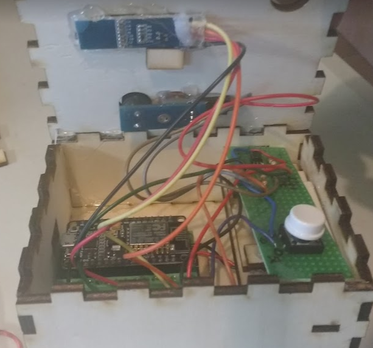
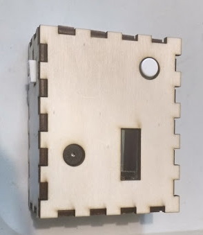
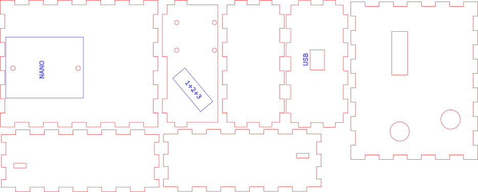

# Alarm Clock Base Station

## Introduction
the base station which shows the clock and allows to program the alarm. 
It also contains a buzzer and a LED strip can be connected to it.

## Clock manual & How to Set Alarm

There is only one button on the alarm clock. The clock has two states: **Clock State** and **Alarm State**. 

In **Clock state**, you can intereact with the alarm and set the alarm time. You use it as follows:

**Long Press** to switch between the three modes:

1. *Normal mode*, show clock. In this mode you see the time on the clock
2. *Alarm program mode*. In this mode you see the set alarm time, and you can change it
3. *No Display mode*. In this mode the display is off. Use it if the display keeps you awake

**Short Press** to program the alarm when in *Alarm program mode*

In *Alarm program mode*, do short press to change the alarm hour. When you reached the correct alarm hour, use long press to store it and move to the setting of the alarm minute. Use short press to change the minutes, and use long press to finish setting the alarm. After changing the alarm, the clock is again in *Normal mode*.  

In **Alarm State** the alarm is going off, and you can only do limited intereaction with the clock. If the buzzer goes, you can do a button press, to switch it off for some time.

To exit the **Alarm State**, you must go out of the bed, watch the screen on the clock for it to indicate it detects you are out of bed (left bottom indicator *Uit Bed*). Then you can do a long press to exit the **Alarm State**.

## Hardware

The Alarm Clock is based on a nodeMCU connected to an OLED screen. We also connect a YL44 buzzer, and a LED strip. Finally, a push button is added allowing to program the Alarm Clock

### Pushbutton

We connect the pushbutton to D7, other side of the button to GND.

### LED strip

Controll of the neopixels is done via pin D3

### OLED 128x32 Display

The display is connected over I2C. We use pin D2 = SDA and pin D1 =SCL

Initialization of the U8g2 depends on the OLED you bought. You might need to change this for another OLED. In our case it is

    // Create a display object
    U8G2_SSD1306_128X32_UNIVISION_F_SW_I2C u8g2(U8G2_R0, pSCL, pSDA, U8X8_PIN_NONE);

### Buzzer YL-44 

This is an active buzzer, it produces sound by itself without
external frequency generator. Sound is in the audible 2 kHz range

Taking the I/O pin LOW will turn the buzzer ON and taking this
pin HIGH will turn the buzzer OFF (as will leaving this pin OPEN). 
This device can be controlled by PWM.

**Problem**: The buzzer is connected to NodeMCU pin D6. This pin has 3V3 login, so the I/O pin
of the buzzer would always be LOW with buzzer on as only with 5V buzzer is off

**Solution**: we add a BC547 NPN transistor on the GND pin of the YL-44. This
allows to connect the I/O pin of the YL-44 to the GND out of the
NodeMCU, and the VCC to the 5V pin. The D6 pin is connected to the 
Base of the BC547, the GND of the YL-44 is connected to the Emittor
(right) of the BC547, and the Collector is connected to the GND of 
NodeMCU.

It is possible to achieve softer sounds using PWM on the D6 pin

### Case
Internal part of case:

External part:

See references below for link to svg file.
## Software

Libraries needed:
1. Time.h & TimeLib.h:  https://github.com/PaulStoffregen/Time
2. Timezone.h: (via install library) https://github.com/JChristensen/Timezone
3. NTPClient.h: (via install library .. replaced by own library for now) https://github.com/arduino-libraries/NTPClient
4. ESP8266WiFi.h & WifiUDP.h: (via adding esp on board manager) https://github.com/ekstrand/ESP8266wifi
5. U8g2: for OLED display via install library
6. Adafruit neopixel library: via install library
7. PubSubClient library: via install library - This is to controll devices via MQTT

## Messages
This module sends and reacts to the following MQTT messages:

1. **intellettoStatus**
The base station publishes on this channel. Subscribe to this topic to see status messages

2. **intelletto**
Test topic to see if alarm connected correctly to the broker and can execute commands. Payload `c1` will switch on builtin LED of the NodeMCU, `c0` will switch it off.

3. **intellettoBedSensor**
The base station listens to these messages to determine if somebody in bed, see in bed module

4. **intellettoMassage**
The station sends messages to control the massage. See massage module

5. **cmnd/sonoff_ventilator/power**
The stations sends messages to set ventilator on or off

6. **cmnd/sonoff_light/power**
The stations sends messages to set light on or off

7. **intellettoLoudSp**
The stations sends messages to have messages played. See message module.

# Resources

* [The NodeMCU code](../alarmblanket/intelletto/intelletto.ino/)
* The lasercut files

