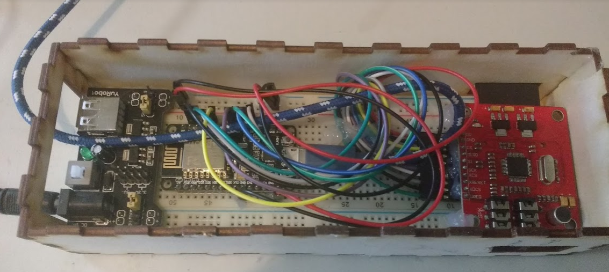

# Wake Sound system

This module generates textual sounds to help you wake up.

All modules of [Intel.Letto](https://github.com/TeamScheire/intel.letto): [module overview](https://github.com/TeamScheire/intel.letto#intelletto-modules).

## Hardware

This module is based on a NodeMCU which uses a VS1053 board (from Geeetech) to play sound fragments. 
We also use a YwRobot Breadboard Power Supply for the power. 

| Pin        | VS1053           | NodeMCU v1.0  |
| ------------- |:-------------:| -----|
| 5V     | 5V | Vin if 5V on Vin ! |
| GND     | GND      |   GND |
| CARDCS | CS      |    D4 |
| SPI:MISO | MISO      |    D6 |
| SPI:MOSI | SI      |    D7 |
| SPI:SCK | SCK      |    D5 |
| BREAKOUT_CS | XCS      |    D8 |
| BREAKOUT_RESET | XRESET      |    D3 |
| BREAKOUT_DCS | XDCS      |    D1 |
| VS1053 Data Request | DREQ      |    D2 |

We install everything on a breadboard, and build a box around it. In order to be able to flash the nodeMCU without opening 
the box, an usb cable is left plugged into the nodeMCU.

The resulting module looks like:

## Software

1. Installeer [Arduino IDE](https://www.arduino.cc/en/Main/Software)

2. Download the [TM1638 library](https://drive.google.com/file/d/1I5QT2MukBGyKPgp6yOOyyVyNVsKazJKb/view?usp=sharing)
as a zip file

3. In the IDE, select *Sketch--> use library --> add zip library* and select the downloaded
zip  (tm1638-library-master.zip) to install it.

4. In Arduino, select menu *Sketch --> use library --> manage library...*, and search on 
SDFat. Install SDFat by Bill Greimann. We used version 1.0.3. Click on install to install it

5. Dowload the [SFEMP3Shield library](https://drive.google.com/file/d/1z0240bGxVDGQsvheKpqEbbXS39dFnQSy/view?usp=sharing)
as a zip file. 
In the IDE, select *Sketch--> use library --> add zip library* and select the downloaded
zip  (SFEMP3Shield.zip) and install it

## Messages
This module sends and reacts to the following MQTT messages:

**intellettoLoudSp**

The stations reacts to messages on this channel. Messages are required to be of the form:
 
 
    S 

This will stop playback. To play a track, the message must be:

    DXXXTXXXVXXX

Directory is a nummer three long, eg 022, this is followed by TXXX, with XXX the track number
and then followed by VXXX, with XXX volume, 0 being loud, 255 silent.

On the SD card plugged into the VS1053, the directory structure must fit this. If message is D001T001V000, then 
there must be on the SD card a track:

    D001/TRACK001.mp3

# Resources

* [The NodeMCU code](../alarmblanket/inteletto_wake_loudspeaker/wake_loudspeaker/)

# Usefull links

* http://www.geeetech.com/wiki/index.php/VS1053_MP3_breakout_board_with_SD_card 
* http://www.instructables.com/id/Wifi-Webradio-With-ESP8266-and-VS1053/ 

