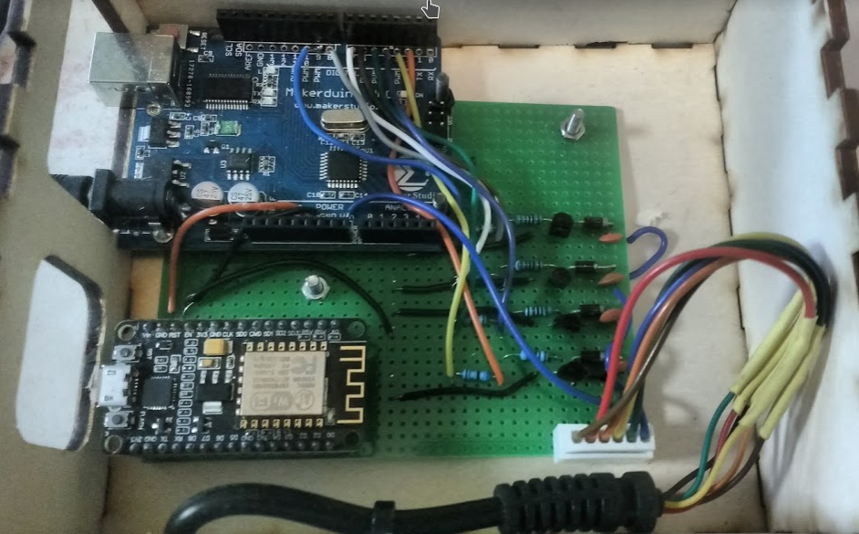

# Massage Module

## Introduction
For the massage module we hack a commercial massage mattress. We do it in such a way we can control the mattress by an Arduino UNO.
Next we need to be able to controll what the mattress does over WiFi. For this, we make the Arduino UNO a slave of a master
NodeMCU device, which collects MQTT messages, and sends them over I2C to the Arduino UNO that controls the mattress then.

## Massage Mattress

We hack the [Colchón masaje jocca 6163+ Regalo Báscula](https://www.latiendaencasa.es/cuida-tu-salud/A20598994-colchon-masaje-jocca-6163--regalo-bascula/)
This is available on eg [Amazon](https://www.amazon.de/Matratze-Massageeffekt-Jocca-10-Motoren-Modi/dp/B00BSDVK98/ref=sr_1_1?ie=UTF8&qid=1518777167&sr=8-1&keywords=jocca+6163)

Source: 12V DC, 1.2A, 14.4W 

Opening the cable to the mattress, and using the multimeter to measure things, we see that:

* Black: 12V
* Brown: Neck portion, voltage: off 12V, low 4V, mid 2V, high 0V
* Red: Breast portion, voltage: off 12V, low 4V, mid 2V, high 0V
* Orange: Belly portion, voltage: off 12V, low 4V, mid 2V, high 0V
* Yellow: Hip portaion, voltage: off 12V, low 4V, mid 2V, high 0V
* Green: Temperature part for heating, off 12V, on 0.2V

Chip controller is a Sonix SN8P2602CPB 137AN Z01: [datasheet](http://www.alldatasheet.com/view.jsp?Searchword=SN8P2602CPB)

De massage motors connect via a diode to 12V and condensator 104 to 12V to a transistor SS8050 D 331. 
This is an NPN  transistor. The emitter is on 0V. The Collector goes to the mattress (secured with a diode and a condensator 104).
The Base of the transistor is connected via a 510 Ohm resistor to a digital pin (0 of 5V). 
For Low vibration 2.5V, for Medium 3.75V. 

The temperature circuit connects to a transistor D965 R011, which is an NPN transistor.
The Emitter is connected to the 0V lijn. The collector goes to the matras. The Base connects to a 510 Ohm resistor to 
a digital pin.

### Hacking
Desolder the transistors, the diode, the condensator and the resistors, and recreate the circuit on a breadboard. Connect 
the emittors over a 510 Ohm resistor to digital
pins of the Arduino. We use the 2, 4, 6 and 8 pin. Put another xxx resistor and series, and connect this also to 
a digital pin of the Arduino for the  mid power setting of the massage. We use pins 3, 5, 7 and 9. Wiring:

    int NeckMotorsSTRONG = 2;
    int NeckMotorsWEAK = 3;
    int BreastMotorsSTRONG = 4;
    int BreastMotorsWEAK = 5;
    int BellyMotorsSTRONG = 6;
    int BellyMotorsWEAK = 7;
    int HipMotorsSTRONG = 8;
    int HipMotorsWEAK = 9;

Take a power brick of 12V, 1.2A to power the Arduino. The massage mattress has such a power brick you can use. 
The 12V input is also used to power the massage mattress. Connect the Vin (12V) to the black wire of the mattress. 

The NodeMCU is powered with the GND and 5V pins of the Arduino UNO. On the NodeMCU, I2C pins are `int pSDA = D2;` and
`int pSCL = D3;`

These connect to their counterparts on the Arduino: A4 (SDA), A5 (SCL).

The resulting module:

# MQTT
## Important Remark

The NodeMCU must be programmed still with the WiFi credentials. However, this can **ONLY** hammen when the NodeMCU is **NOT** connected to the Arduino. So open the module, remove the NodeMCU from the header it is attached to, flash the device with changes needed, then put back in the header.

The Arduino is fully configured and does not need changes in the programming.

## Configuration
The NodeMCU connects via MQTT to the Rasp Pi. In the code, set the correct WiFi credentials and give the IP of the MQTT server:

    // write here your wifi credentials 
    const char* password = "********"; // and password
    const char* ssid = "intelletto";   // insert your own ssid 

    //mqtt server/broker 
    const char* mqtt_server = "192.168.0.212";  //eth0 address of the raspberry pi
    uint8_t mqtt_server_IP[4] = {192, 168, 0, 212};

Then use the Arduino IDE to flash the NodeMCU (see remark above: disconnect the NodeMCU first to do this!).

## Messages
This module sends and reacts to the following MQTT messages:

1. **intellettoMassage**
The massage controller subscribes to this topic and reacts with operating the  massage motors. Publish on it to have the motors working. Following payloads are possible:

  * O: all off
  * code (All, Neck, Breast, Tummy, Hip) + number 0 off, 1 mid, 2 strong in following way:
    * Nx; with x number: 0: Neck off; 1: mid power; 2: strong power
    * Bx; with x number: 0: Breast off; 1: mid power; 2: strong power
    * Tx; with x number: 0: Tummy off; 1: mid power; 2: strong power
    * Hx; with x number: 0: Hip off; 1: mid power; 2: strong power
    * Ax; with x number: 0: Hip off; 1: mid power; 2: strong power
  * P1: start programm 1, which is a preset program

# Resources

* [The Arduino Code master NodeMCU](../alarmblanket/intelletto_massage/massage_control_mqtt_MASTER_NODEMCU/)
* [The Arduino Code slave Arduino UNO](../alarmblanket/intelletto_massage/massage_control_mqtt_SLAVE_ARD/)

