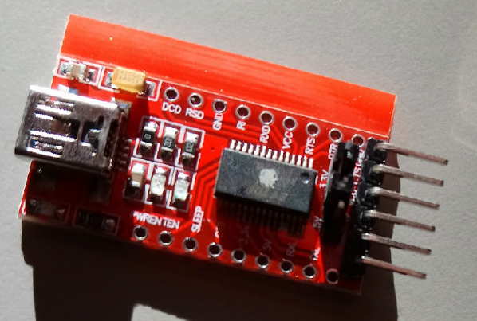
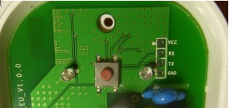
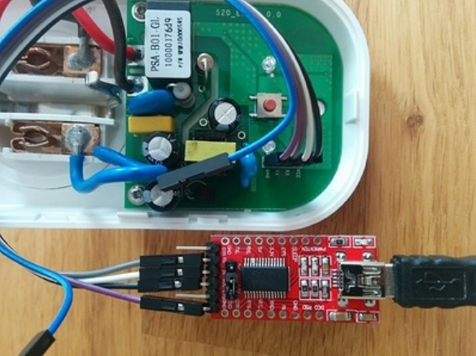
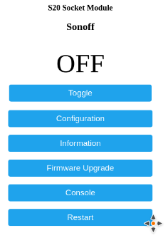
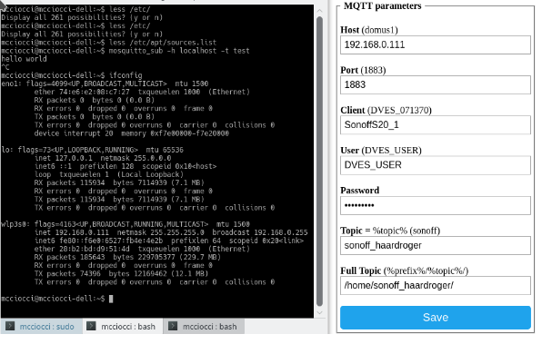
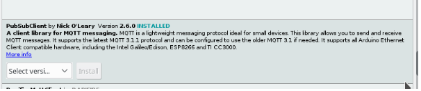

# Sonoff smart plugs

We connect several smart plugs to intel.letto. This allows us to control normal appliances and integrate them in the alarm clock. 
Two components are important:

* daylight light box, used to help in light therapy
* ventilator aimed at the sleeping person

All modules of [Intel.Letto](https://github.com/TeamScheire/intel.letto): [module overview](https://github.com/TeamScheire/intel.letto#intelletto-modules).

## Hacking the Sonoff: Flashing
To use the Sonoff, we flash it with another program, called **Tasmota**, which allows us 
to use MQTT. 
Follow the instruction on [Sonoff-Tasmota wiki](https://github.com/arendst/Sonoff-Tasmota/wiki/Sonoff-S20-Smart-Socket)

You need a usb to serial flashing unit for 3.3V:   

**WARNING:** CHECK THE OUTPUT VOLTAGE, IT MUST BE 3.3, SET JUMPER CORRECTLY TO SELECT VOUT!

The RX and TX lines must be crossed for programming. From top to bottom you have in 
the Sonoff:

Which you should connect on the usb to serial unit to :

* Vcc (3,3V)
* TXD
* RXD
* GND

Hence, the cables should run as follows:

  
You can update with Arduino IDE. Make sure to change the user config settings to your 
liking. 
To change settings for wifi: press 4x the button. 

1. If a sonof-xxxx network comes up, connect to it
2. If a WiFi beginning with ITEAD appears, connect with it by entering default password: 12345678

## Configuration of the Sonoff

1. Press the button 4 times to enter the configuration mode. The LED starts to flash when the configuration mode is active. The device then creates a WiFi access point and the configuration UI is available in IP 192.168.4.1. 
2. Connect in your phone/laptop to the wifi of the plug (Sonoff_????, NOTE: switch off 4G first!!) and point then browser to http://192.168.4.1 
3. Set the credentials of the wifi network the plug should connect to + save. The sonoff will reboot.
4. Check the router of the wifi to know the IP address of the plug. For the IngegnoMakerSpace, http://192.168.0.1/ and log in the tplink. Go to wifi list, you will see a line:

    sonoff_s20_1-4976  192.168.0.159

5. Go the sonoff with the webbrowser with the IP adres you found: `http://192.168.0.159` 
6. You obtain following web page:
  

7. Add a device to the plug, and hit toggle to test!

## MQTT 
The best  protocol to control smart devices from a programming language is MQTT. MQTT is a machine-to-machine (M2M)/"Internet of Things" connectivity protocol. It was designed as an extremely lightweight publish/subscribe messaging transport. 

You need to set up a broker on a computer that will act as the server. We use https://mosquitto.org/ 
On Ubuntu:

    sudo apt-get install mosquitto mosquitto-clients

Once installed, ubuntu automatically starts mosquitto. Test, in one terminal window subscribe to channel test:

    mosquitto_sub -h localhost -t test

In another terminal tab, send a message to channel test:

    mosquitto_pub -h localhost -t test -m "hello world"

-h is the server, here the pc itselves, -t the channel, and -m the message

This shows all works. If you send data over the internet instead of locally, you should encrypt and set up security. Follow the guide: https://www.digitalocean.com/community/tutorials/how-to-install-and-secure-the-mosquitto-mqtt-messaging-broker-on-ubuntu-16-04 
We will work locally, so this is not needed. We will work locally as follows:

We use as server a Raspberry Pi, see our README.md. Clients are the Sonoff plugs and ESP NodeMCU’s which receive 
messages via MQTT to do actions.

## Connect Sonoff and MQTT broker

Determine the IP of the raspberry pi with mosquitto on it, and set in the Sonoff MQTT configuration the options 
(a topic).
  

Command to switch on the plug is then for example for above screenshot:

    mosquitto_pub -h 192.168.0.111 -t cmnd/sonoff_haardroger/power -m 1

And a 0 to switch back off.

## MQTT on NodeMCU
Install PubSubClient in the Arduino IDE:

Test with example sketch Mqtt_ep8266. Set ssid and password to your wifi, and point the mqtt_server to the MQTT 
server on your local network. 

Open the serial monitor after uploading the sketch to a NodeMCU.
On the server, subscribe to the messages being generated:

    mosquitto_sub -h localhost -t outTopic

See if messages arrive. Next, send some messages also to switch off and on the NodeMCU led:

    mosquitto_pub -h localhost -t inTopic -m "0 test off"
    mosquitto_pub -h localhost -t inTopic -m "1 test on"

If this works, mqtt is possible over the local network.

## NodeMCU controlling Sonoff via MQTT
With the protocol working, we can switch sonoff plugs on and off. The plugs must point to the same mqtt server.

## Using the Raspberry Pi as broker
See README.md for the setup of the Raspberry Pi.
